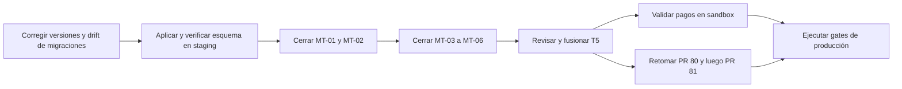

# NugaCore — Estado actual, avances y pendientes

> Resumen ejecutivo para técnicos, producto y agentes.
> **Actualizado: 2026-07-30.**
> **HEAD revisado:** `c9863a2` en `origin/main`.
> Informe detallado y reproducible:
> [`REPO_REVIEW_2026-07-15_29.md`](./REPO_REVIEW_2026-07-15_29.md).
> Documento sanitizado: no contiene credenciales, tokens ni identificadores privados de operación.

## Veredicto actual

NugaCore tiene una base funcional amplia para **desarrollo y staging/lab**, pero
el `main` actual **no debe promoverse ni desplegarse como producción**. El
bloqueo principal no es falta de funcionalidades: existe una diferencia
verificada entre el código de `main` y el esquema aplicado en staging, además de
hallazgos críticos de aislamiento multi-tenant y una corrección de webhooks de
pagos todavía fuera de `main`.

## Qué se ha desarrollado

El informe de cierre del 15 al 29 de julio contabiliza 136 commits integrados,
66 PRs fusionados, 24 archivos de migración y 53 archivos de pruebas nuevos.

| Línea de trabajo | Estado resumido |
| --- | --- |
| SaaS multi-tenant | Fundación, membresías, scoping de dominios y RLS integrados; quedan seis hallazgos MT abiertos |
| Auth y onboarding WISP | Registro público, confirmación y recuperación de email, onboarding obligatorio y reparación de sesiones/tenants |
| CRM, planes, facturación e inventario | Persistencia y aislamiento por tenant ampliados; provisión cliente por zona/plan implementada |
| FTTH, GIS y OLT | Importación CSV/GeoJSON, NAP, mapa y alta inicial OLT integrados; factibilidad y worker OLT siguen en PRs separados |
| MikroTik y RouterOS | Enrollment, scripts endurecidos, ACL base, telemetría SNMP tenant-scoped y vista NOC integrados |
| WireGuard | Host-apply, IPAM y base multi-tenant integrados detrás de un flag; live/provisión siguen sujetos a gate |
| Pagos e integraciones | Configuración cifrada por WISP, OpenPay/SPEI/CoDi e idempotencia implementadas en código; despliegue bloqueado por esquema y fencing |
| UI y operación | Apps aisladas, portal, PWA técnicos, navegación, alertas y limpieza de datos demo avanzadas |
| Calidad y documentación | Contratos y pruebas crecieron; el informe retrospectivo y el inventario de migraciones quedaron publicados |

## Pendientes priorizados

### P0 — bloquean cualquier despliegue del `main` actual

1. **Alinear staging con las migraciones de pagos.** Aplicar, mediante el flujo
   autorizado, `20260725210000` y `20260728120000`; el código de webhooks ya está
   en `main`, pero sus columnas y restricciones todavía no están en staging.
2. **Reparar el drift del SSOT multi-tenant.** Existe una colisión del prefijo
   `20260717050000`: el historial marcó la versión como consumida por otra
   migración y `multi_tenant_complete_ssot` no se aplicó. Se necesita una nueva
   migración idempotente, con versión única, y verificación columna por columna.
3. **Cerrar MT-01 y MT-02.** Son los hallazgos críticos: acceso/escritura sin
   tenant en `notifyInvoice` y resolución de tenant que puede caer de forma
   abierta a `tenant-default`.
4. **Confirmar y fusionar el fencing interno de webhooks (T5).** El informe
   detallado registra una corrección con checkpoints por efecto en `26f0b8c`,
   pero ese commit no es alcanzable desde las referencias remotas obtenidas en
   esta revisión. Se debe recuperar/verificar el cambio, hacer revisión fría y
   abrir/fusionar su PR antes de desbloquear pagos para despliegue.

### P1 — necesarios antes de ampliar la operación

1. Cerrar MT-03 a MT-06: persistencia de `tenant_id` en integraciones, contratos
   de pagos con tenant obligatorio, integridad referencial compuesta y resolución
   correcta del tenant en CoDi.
2. Mantener el carril FTTH detenido hasta cerrar los bloqueos multi-tenant;
   después, revisar/fusionar primero PR `#80`, retargetear PR `#81` a `main` y
   ejecutar todos sus gates de CI.
3. Probar OpenPay/SPEI/CoDi contra un sandbox real autorizado. Hoy la cobertura
   es hermética; no existe evidencia end-to-end con el proveedor.
4. Añadir a CI una validación que rechace dos migraciones con el mismo prefijo de
   versión para evitar otro drift silencioso.
5. Verificar persistencia tras reinicio, backups/restore, RBAC por rol y demás
   gates de [`PRODUCTION_READINESS_CHECKLIST.md`](../deployment/PRODUCTION_READINESS_CHECKLIST.md).

### P2 — deuda operativa y de mantenimiento

- Activar y verificar protección contra contraseñas filtradas en Supabase.
- Resolver el baseline de warnings de lint de forma incremental.
- Revisar `db/apply-advisor-migrations` y limpiar ramas remotas de PRs ya cerrados.
- Mantener documentos de estado y sincronización de migraciones alineados al
  `HEAD` real.

## Trabajo explícitamente no terminado

- No se ejecutó despliegue desde el informe del periodo.
- No se aplicaron las migraciones posteriores a `20260724195354` en staging.
- No existe E2E contra el sandbox real de OpenPay.
- No se habilitó provisión FTTH/WISP live.
- El worker OLT y la factibilidad FTTH no están integrados en `main`.
- La ejecución RouterOS/MikroTik live permanece fuera de alcance sin autorización
  explícita.

## Orden recomendado de ejecución

## Fuentes canónicas

| Necesidad | Documento |
| --- | --- |
| Informe completo de lo desarrollado y pendiente | [`REPO_REVIEW_2026-07-15_29.md`](./REPO_REVIEW_2026-07-15_29.md) |
| Brechas históricas de producción | [`PRODUCTION_GAP_REPORT.md`](./PRODUCTION_GAP_REPORT.md) |
| Checklist de producción | [`../deployment/PRODUCTION_READINESS_CHECKLIST.md`](../deployment/PRODUCTION_READINESS_CHECKLIST.md) |
| Sincronización de migraciones | [`../deployment/SUPABASE_MIGRATIONS_SYNC.md`](../deployment/SUPABASE_MIGRATIONS_SYNC.md) |
| Handoff operativo | [`SPRINT_HANDOFF_2026-07-15.md`](./SPRINT_HANDOFF_2026-07-15.md) |

## Guardrails

- No desplegar `main` actual hasta resolver P0 y revalidar el esquema.
- No ejecutar migraciones, RouterOS live ni provisión real sin autorización.
- No publicar secretos, JWTs, contraseñas, claves, hosts privados ni logs crudos.
- Toda aprobación de staging debe confirmar primero el commit en `origin/main`.
