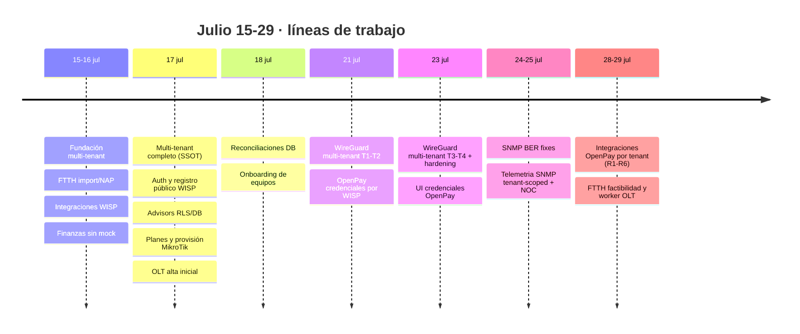

# Revisión del repositorio — 15 al 29 de julio de 2026

> Revisión retrospectiva de dos semanas de trabajo en `nugacorp/NugaCore-v2`.
> Incluye una verificación del esquema de staging hecha el 2026-07-29 que
> **descubrió drift silencioso de migraciones**; ver
> [Estado de las migraciones](#estado-de-las-migraciones--verificado-el-2026-07-29).

## Alcance y método

Periodo cubierto: **15 al 29 de julio de 2026**. Para reconstruir la secuencia de
trabajo sin partir PRs en el cambio de zona horaria, el inventario de PRs usa el
intervalo continuo `#15`–`#82`: contiene 66 PRs mergeados y 2 abiertos, pero no
debe interpretarse como un conteo de ventana calendario estricta. En
`America/Tijuana`, el PR `#82` se fusionó el 29 de julio; los PRs `#15`–`#18`
quedan incluidos como contexto inmediatamente anterior al inicio local.

Cómo se obtuvo cada dato, para que sea reproducible y auditable:

| Fuente | Qué aporta |
| --- | --- |
| `git log origin/main --since=2026-07-15` | Commits realmente integrados en la línea principal |
| `gh pr list/view/checks` | PRs mergeados y abiertos, CI real |
| `psql` al pooler de Supabase (solo lectura) | **Estado verificado** del esquema en staging vs migraciones del repo |
| Artifacts de planificación y revisión del periodo | Decisiones, tickets y revisiones frías |

Distinción que se mantiene en todo el documento: lo que **se verificó contra la
base de datos** está marcado como tal; lo que proviene de una revisión previa se
atribuye a esa revisión.

## Resumen ejecutivo

| Métrica | Valor |
| --- | --- |
| Commits en `main` | **136** |
| PRs mergeados en el universo `#15`–`#82` | **66** |
| PRs abiertos | **2** (`#80`, `#81`) |
| Archivos tocados | 299 |
| Líneas | +24 795 / −2 455 |
| Archivos de migración nuevos | 24 (22 prefijos de versión únicos) |
| Archivos de test nuevos | 53 |
| Migraciones del repo **sin aplicar** en staging | **3** (una de ellas silenciosa) |

Autoría de los commits: Cursor Agent 55, nugacorp 28, Ramiro Nuñez Renteria 26,
cursor[bot] 15, root 12.

Distribución por fecha de autor de los commits presentes en `main`:

| Fecha | Commits |
| --- | --- |
| 16 jul | 36 |
| 17 jul | 56 |
| 18 jul | 12 |
| 21 jul | 6 |
| 23 jul | 17 |
| 24 jul | 6 |
| 25 jul | 2 |
| 29 jul | 1 |

El grueso del trabajo se concentró en el 16–18 (fundación multi-tenant y
saneamiento de auth/DB) y luego pasó a slices más profundos y con revisión
adversarial (WireGuard, SNMP, OpenPay).



## Lo que se construyó, por línea de trabajo

### 1. Fundación multi-tenant (16–18 jul)

La pieza estructural del periodo: el producto pasó de single-WISP a SaaS
multi-inquilino.

- `#36` **foundation multi-tenant**: `tenant_memberships`, helper
  `is_tenant_member`, `tenant_id` con FK y backfill en `clients`, `towers`,
  `tower_onboarding_profiles`, `plans`, `invoices`, `network_sectors`; RLS
  service-role en 9 tablas.
- `#57` aislamiento de routers MikroTik y enrollment por tenant.
- `#58` **multi-tenant completo**: tickets, work orders, pagos, cobranza, GIS,
  client-360, suspensión, métricas de dashboard, planes, facturas, portal
  staff/cliente, comercial, finanzas y reportes.
- `#59` tolerancia a `tickets.tenant_id` ausente en dashboard-stats.
- Durante la propia migración se detectó y corrigió **una escalada de
  privilegios** en la versión original de `is_tenant_member` (autorizaba por
  claim JWT `app_metadata`); se cerró antes de aplicar.
- Documentación: `architecture/MULTI_TENANT.md` (6 revisiones en el periodo).

### 2. Auth, registro público y onboarding WISP (16–17 jul)

Una cadena de 13 PRs sobre el alta real de WISPs, casi todos correcciones
encontradas en uso:

`#40` confirmación de email y reset de password · `#45` activar registro público
· `#46` persistir tenants en DB (500 en registro) · `#47` correo de confirmación
solo tras persistir · `#48` no repetir paso de empresa · `#49` sanar tenant
ausente y frenar spam de 403 · `#50` limpiar sesión zombie que causaba 401 en
`/api/auth/me` · `#52`/`#53` reenvío de confirmación y copy de rate-limit · `#54`
exponer rate limits de Supabase · `#55` no encuestar alertas durante onboarding ·
`#60` quitar «reenviar» del login · `#37` onboarding obligatorio + login limpio.

Se añadió `auth/EMAIL_CONFIRMATION_AND_RECOVERY.md`. El gate de onboarding pasó
de **fail-open a fail-closed** (`20260717040000`): un tenant nuevo nace
`in_progress` y exige el wizard.

### 3. Saneamiento de base de datos y advisors (16–18 jul)

- `#41` revocar `EXECUTE` de `is_tenant_member` a `anon`/`authenticated`
  (advisor SECURITY DEFINER).
- `#42` envolver `auth.role()` en `(select …)` en políticas service_role
  (lint 0003 `auth_rls_initplan`).
- `#43` índices de cobertura para FKs sin índice.
- RLS habilitada en `wisp_integration_settings`, `tower_onboarding_profiles`,
  `fiber_segments`/`fiber_threads`, tablas de transferencias e inventario.
- `#38`/`#39` reconciliación y documentación del drift GitHub↔Supabase;
  `deployment/SUPABASE_MIGRATIONS_SYNC.md` se tocó 13 veces (el archivo más
  editado del periodo junto a `src/App.tsx`).
- Queda pendiente en Dashboard (no SQL): `auth_leaked_password_protection` **ON**.

### 4. FTTH y GIS (15–17, 29 jul)

- `#33`/`#34` importador CSV/GeoJSON, vista interna NAP y exportación real desde
  staging; `runbooks/FTTH_IMPORT_SAMPLE_EXPORT.md`.
- `#29`/`#30` mapa Co-Map con Leaflet y separación Mapa FTTH / Torres estilo UISP.
- `#63` `/api/naps` 500 por embed ambiguo `nap_ports`.
- `#64` IPAM real, inventario sin mocks y campos FTTH en el alta.
- `#66` alta de OLT + configuración inicial recomendada + script de arranque.
- **Abiertos:** `#80` factibilidad de preventa por coordenada (slice 1) y `#81`
  fundación del worker OLT + checklist de campo (slices 2 y 4).

### 5. MikroTik, RouterOS, enrollment y SNMP (15–25 jul)

- `#62` baseline ACL de cliente con listas `nc-*` estilo WispHub;
  `mikrotik/ACCESS_CONTROL_BASELINE.md`.
- `#61` catálogo de planes + alta de cliente por zona con provisión MikroTik.
- `#72` abrir onboarding completo de router para admins · `#73` plantilla de
  fábrica segura · `#74` incluir PSK de enrollment en el peer WireGuard · `#75`
  permitir redescarga del script.
- Cadena SNMP: `#71` decodificar respuestas anidadas · `#76` codificar
  GetRequest con tag BER de PDU · `#77` TimeTicks de longitud variable · `#78`
  telemetría SNMP tenant-scoped + vista operativa NOC · `#79` columna SNMP en
  Sistema → Routers.
- `#51` estabilizar flake de CI por scan de branding sobre secretos aleatorios.

### 6. WireGuard multi-tenant (21–23 jul)

Slice planificado y ejecutado con crítica adversarial y **cinco rondas de
revisión** más una crítica previa:

- T1 fundación DB: subredes por tenant, singleton global, IPAM atómico.
- T2 agente `host-apply` v2: firewall `nft`, arranque fail-closed, PSK;
  `scripts/vps/wg-host-apply-agent.py` + instalador + tests puros.
- T3 backend: contrato v2, estados de peer, server global, flag
  `WIREGUARD_MULTITENANT`.
- T4 UI: wizard con servidor global, bloque del tenant y estados de peer.
- Hardening posterior: aislamiento `nft` completo, ACKs condicionados, cierre de
  carreras de snapshot, **bump de revisión y mutación atómicos**, orden de reglas
  de firewall validado.
- `#68` entró con el flag **apagado**; `#69` persistió el gate de forwarding de
  Docker; `#70` reconcilió columnas de tenant.
- Cierre documentado con matriz negativa con flag on y vigilancia de 24 h del
  primer router real.

### 7. Integraciones y pagos OpenPay por tenant (16, 21, 23, 25, 28–29 jul)

La línea más intensa en verificación de todo el periodo.

- `#35` configuración WISP de Stripe/WhatsApp/Telegram/CoDi.
- `3e23888` **cifrado en reposo (AES-256-GCM)** de las credenciales de
  integraciones + onboarding fail-closed.
- `69f272e` vía SPEI/CoDi por OpenPay (estructura, explícitamente **sin
  verificación end-to-end**).
- `#67` credenciales OpenPay por WISP con UI (sandbox/producción) + migración
  `20260721120000`.
- `#82` **integraciones OpenPay aisladas por tenant** (+3 957/−281, 38 archivos),
  mergeado por squash como `a31c812`: resolución de credenciales por tenant (T2),
  webhook con token por tenant e idempotencia (T3), URL única de webhook por
  WISP en UI (T4).

Este PR pasó por **seis rondas de revisión fría** antes de mergearse, y cada
ronda encontró defectos reales:

| Ronda | Resultado |
| --- | --- |
| R1 | 4 defectos: fail-open del webhook legacy, idempotencia no atómica, `tenant_id` nullable, lookup cruzado entre tenants |
| R2 | 6 defectos, 4 de entrega real de pagos: `charge.succeeded` con `transaction.status=completed` tratado como no aprobado, identidad de evento sin `eventType`, HTTP 200 a claim vivo |
| R3 | 5 hardenings: HMAC sobre bytes no firmados vía `text/plain`, token filtrado en logs de rate-limit y error, `42P01` cayendo a `env`, CoDi respondiendo 200 a claim vivo, lease sin fencing |
| R4 | 1 defecto: fencing no verificado entre efectos |
| R5 | 1 defecto: CoDi directo cerraba el evento sin ejecutar la reactivación pendiente |
| R6 | **Aprobada** sin hallazgos HIGH/MEDIUM |

Decisión de producto fijada en el camino: **el toggle de OpenPay es
autoritativo**. Sin fila persistida, `env` conserva compatibilidad legacy; con
fila persistida y OpenPay apagado, provider y webhook quedan bloqueados aunque
existan credenciales globales.

### 8. UI, PWA, portal y finanzas (15–17 jul)

`#27` portal del cliente usable con enlace para compartir · `#28` App Técnicos
usable con enlace · `#65` administrar portal del cliente y sección Apps · `#56`
modal de perfil sobre el sidebar · `#26` eliminar clientes de prueba que inflaban
el MRR · `#25` recuperar chunks Vite obsoletos tras deploy · `#23` Routers en
Sistema y limpieza de inventarios huérfanos · `#22` acciones UI de alta de
routers · `#24` reutilización de sesión API MikroTik · finanzas sin datos mock,
DELETE de gastos y alta
persistente · stepper de onboarding por torre con auditoría visible · manual de
usuario actualizado.

### 9. Operación y despliegue

`scripts/vps/deploy-coolify-staging.sh` se tocó 7 veces:
`WISP_PUBLIC_REGISTRATION`, `APP_URL` + `SUPABASE_ANON_KEY` para correos de Auth,
`NUGACORE_LIVE_MODE`, pollers NOC/SNMP y `USE_DB_FINANCE`. Se mantuvieron los
gates de producción, métricas Prometheus y runbooks introducidos justo antes del
periodo.

## Estado de las migraciones — verificado el 2026-07-29

Se consultó `supabase_migrations.schema_migrations` y el catálogo de columnas por
`psql`. Resultado: **el historial dice que todo está aplicado hasta
`20260724195354`**, pero hay tres migraciones del repo cuyo efecto **no existe**
en la base.

### Hallazgo 1 (grave, silencioso) — colisión de versiones oculta una migración entera

Dos pares de archivos comparten el mismo timestamp de versión:

| Versión duplicada | Archivos | Nombre registrado en la DB | Realidad verificada |
| --- | --- | --- | --- |
| `20260717040000` | `mikrotik_router_tenant` + `onboarding_status_fail_closed` | `onboarding_status_fail_closed` | Sin daño: `mikrotik_routers.tenant_id` **sí existe** (lo reaplicó `20260718175423`) |
| `20260717050000` | `multi_tenant_complete_ssot` + `olt_devices` | `olt_devices` | **`multi_tenant_complete_ssot` nunca se aplicó** |

Evidencia directa de columnas (`t` = existe, `f` = no existe):

```
olts.model                              t   <- olt_devices sí se aplicó
olts.pon_type                           t
olts.provisioning_status                t
clients.tenant_id                       t   <- viene de 20260716200000 (foundation)
invoices.tenant_id                      t
tickets.tenant_id                       f   <- SSOT ausente
work_orders.tenant_id                   f
payments.tenant_id                      f
payment_orders.tenant_id                f
warehouses.tenant_id                    f
wisp_integration_settings.tenant_id     f
```

Por qué importa más de lo que parece:

1. El historial de migraciones **ya registra `20260717050000` como aplicada**,
   así que cualquier `supabase db push` futuro la saltará para siempre. El drift
   no se cierra solo.
2. `main` contiene el código de `#58` que asume ese aislamiento. La app hoy lo
   tolera porque se parchearon los síntomas —`#59` "tolerate missing
   `tickets.tenant_id`"— es decir, **se mitigó en la aplicación un drift de
   esquema que nadie sabía que era drift**.
3. Corrige el diagnóstico del hallazgo **MT-03** de la revisión multitenant: no
   es solo que el repositorio no escriba `wisp_integration_settings.tenant_id`,
   es que **la columna no existe** en staging.

La reparación segura no es borrar historial: hay que crear una migración nueva
con versión propia que reaplique el contenido del SSOT de forma idempotente.

### Hallazgo 2 — dos migraciones de pagos pendientes, con su código ya en `main`

| Versión | Migración | Estado | Riesgo |
| --- | --- | --- | --- |
| `20260725210000` | `integration_settings_openpay_webhook_token` | **No aplicada** (`openpay_webhook_token*` ausente) | El webhook por token del PR `#82` no puede resolver ningún tenant |
| `20260728120000` | `payment_events_tenant_idempotency` | **No aplicada** (`payment_events.tenant_id` y `claim_token` ausentes) | Idempotencia, claim/lease y fencing **no tienen soporte de esquema** |

`payment_events` existe como tabla, pero sin `tenant_id`, sin `claim_token` y sin
la unicidad `(tenant_id, provider, provider_event_id)`. Es decir: **el PR `#82`
está fusionado en `main` y su esquema no está en la base**. Mientras no se
apliquen esas dos migraciones, desplegar ese código a staging es un fallo
garantizado en el camino de webhooks, no una degradación elegante.

Los otros 21 archivos de migración del periodo sí tienen sus efectos aplicados;
el inventario completo suma 24 archivos y 22 prefijos de versión únicos por las
dos colisiones descritas arriba.

## Estado de ramas y PRs al cierre del periodo

### PRs abiertos

| PR | Rama | Tamaño | CI | Nota |
| --- | --- | --- | --- | --- |
| `#80` | `feat/ftth-feasibility` | +1 077/−3, 11 archivos | **PASS** (lint/typecheck/test/build, production readiness, security contract tests) | `CLEAN`, listo para revisión |
| `#81` | `feat/ftth-olt-foundation` | +2 575/−12, 27 archivos | **Sin CI ejecutado** — solo aparece el agente de Cursor en `NEUTRAL` | `CLEAN` pero **no verificado**; no debe mergearse así |

`#81` ya está apilado sobre `#80`: su base es `feat/ftth-feasibility@6eed45f` y
su diff propio contiene solo `c6ad482` (worker OLT). La secuencia correcta es
revisar/fusionar primero `#80`, retargetear después `#81` a `main` y ejecutar sus
gates antes del merge.

### Ramas remotas sin integrar

| Rama | Adelanto | Fecha |
| --- | --- | --- |
| `origin/feat/ftth-olt-foundation` | 2 | 29 jul |
| `origin/feat/ftth-feasibility` | 1 | 29 jul |
| `origin/fix/factory-enrollment-schema-rollback` | 1 | 24 jul |
| `origin/fix/admin-router-factory-onboarding` | 1 | 24 jul |
| `origin/fix/snmp-ber-response-parser` | 1 | 23 jul |
| `origin/db/apply-advisor-migrations` | 3 | 17 jul |

Las tres del 23–24 de julio corresponden a PRs **ya mergeados** (`#71`, `#72`,
`#73`): son ramas remotas que quedaron sin borrar, no trabajo pendiente.
`db/apply-advisor-migrations` sí conviene revisar: lleva 12 días con 3 commits
sin integrar.

## Riesgos y bloqueos abiertos

Ordenados por lo que puede romper producción primero.

### B1 — Esquema de `main` no está en la base (verificado)

`#82` fusionado sin sus dos migraciones aplicadas, y el SSOT multi-tenant nunca
aplicado con su versión ya marcada como consumida. **Bloquea cualquier deploy**
del código actual de pagos. Ver Hallazgo 1 y 2.

### B2 — Seis bloqueos multitenant sin cerrar (MT-01…MT-06)

De la revisión multitenant del 27–29 de julio, todos abiertos:

| ID | Severidad | Problema |
| --- | --- | --- |
| MT-01 | Crítico | `notifyInvoice` ignora el tenant recibido: factura, cliente, torre y timeline se buscan/escriben sin tenant. Un WISP con el ID de otro puede leer sus datos y escribir en su cronología |
| MT-02 | Crítico | La resolución de tenant **falla abierto** hacia `tenant-default`: un error de DB o un usuario sin membresía obtiene acceso al WISP por defecto |
| MT-03 | Alto | `wisp_integration_settings.tenant_id` no se persiste — y, según la verificación de esquema, **la columna tampoco existe** |
| MT-04 | Alto | `tenantId` opcional en los contratos de pagos: con service-role, omitirlo consulta o actualiza globalmente |
| MT-05 | Alto | La base no impide relaciones cruzadas: las FKs validan el ID del recurso, no que ambos registros compartan tenant. Faltan uniques `(tenant_id, id)` y FKs compuestas |
| MT-06 | Medio | El webhook CoDi público no resuelve WISP y cae a `tenant-default` |

El gate declarado por esa revisión: **no iniciar migraciones FTTH/WISP ni
habilitar provisión live hasta cerrar los seis**. Los PRs `#80` y `#81` abiertos
pertenecen justamente al carril FTTH, así que ese gate los alcanza.

### B3 — T5: fencing interno de efectos de webhook

Una revisión fría tardía sobre `#82` ya fusionado encontró dos ventanas internas
reales que los fixes R1–R6 no cerraron: el claim podía perderse **dentro** de
`findInvoiceById` y aun ejecutar `recordPayment`, y la reactivación agrupaba
estado, timeline, acción MikroTik y auditoría bajo una sola barrera externa. Por
eso `#82` quedó **fusionado pero bloqueado para deploy**.

El PR correctivo (`fix/payment-webhook-internal-fencing`) fue a revisión fría
independiente y volvió **NO APROBADA** por un HIGH reproducible: la reanudación
solo deduplicaba `createAction`, así que cuando el nuevo dueño del lease retoma
el trabajo repetía los efectos ya completados. Con `PAYMENTS_ROUTER_LIVE=true` el
repro produce `dispatchCalls: 2` y `networkOrders: 2` — **dos órdenes de red
reales para una sola reactivación**; en dry-run se duplican timeline y evento de
suspensión.

Corregido después con TDD en `26f0b8c` (`fix(payments): checkpoint webhook
reactivation effects`): se persisten checkpoints independientes por paso en
`action.result._webhookReactivationProgress` —cambio lógico, timeline, dispatch de
red, evento de suspensión y alerta— reutilizando la acción durable y
`PaymentRepository.updateAction`, sin drift de esquema ni de contrato. El nuevo
dueño del lease lee ese progreso, omite los pasos confirmados y completa los
pendientes; el modo live/dry-run queda fijado por la acción original para no
cambiar semántica entre dueños. Gates: fencing dirigido 33/33, matriz de pagos
183/183 en 13 archivos, `npm test`, lint con ambos typechecks, build y diff-check
en verde. **Pendiente de revisión fría de confirmación**; el PR correctivo no se
ha abierto ni fusionado.

Riesgo residual, sin sobreafirmar exactly-once: queda una ventana que empieza
cuando el destino confirma el efecto y termina cuando `updateAction(result)`
persiste el checkpoint. Una caída del proceso o un fallo del checkpoint ahí puede
repetir ese efecto. Cerrarla para el router exige idempotency key estable en el
destino o una transacción atómica destino+checkpoint, fuera del contrato de T5.

### B4 — PR `#81` sin CI

27 archivos y +2 575 líneas sin lint, typecheck, tests ni build ejecutados. Es un
PR apilado correctamente sobre `#80`, pero debe retargetearse a `main` y ejecutar
CI después de que su base se fusione.

### B5 — Verificación pendiente de pagos reales

OpenPay/SPEI/CoDi está implementado y revisado en profundidad, pero **nunca se
ejercitó contra el sandbox real**. `69f272e` lo dice explícitamente
("estructura, sin verificar end-to-end"). Toda la confianza actual viene de tests
herméticos con el payload oficial documentado, no de tráfico real.

### B6 — Deuda menor

- `auth_leaked_password_protection` sigue OFF en el Dashboard de Supabase.
- CLI `supabase` roto localmente por `db.health_timeout` en
  `supabase/config.toml`; se opera por `psql` al pooler.
- Fila huérfana `20260619033952` en el historial (inocua, documentada, se deja a
  propósito).
- 118 warnings de lint preexistentes, estables como baseline.
- Ramas remotas de slices cerrados sin limpiar.

## Decisiones durables tomadas en el periodo

| Decisión | Alcance |
| --- | --- |
| El toggle de OpenPay es autoritativo | Fila persistida y deshabilitada bloquea provider y webhook aunque existan credenciales en `env`; `env` solo sirve sin fila persistida |
| Onboarding fail-closed | `tenants.onboarding_status` DEFAULT `in_progress`; un tenant nuevo exige wizard |
| Secretos de integraciones cifrados en reposo | AES-256-GCM en la app; secretos nuevos van en `env`, no en DB |
| Error de lectura de settings propaga 500 | Fail-closed deliberado: convertirlo en "fila ausente" reactivaría el fallback de `env` |
| WireGuard multi-tenant entra con flag apagado | `WIREGUARD_MULTITENANT` off en el merge; activación es acción del operador |
| Autorización de `is_tenant_member` por membresía, no por claim JWT | Se corrigió la escalada antes de aplicar la migración |
| No borrar historial de migraciones | Ante drift, añadir migración idempotente nueva; nunca borrar filas |

## Lo que explícitamente no se hizo

Para que no se lea como cobertura que no existe:

- **Ningún deploy** ejecutado por agentes en el periodo; girar gates y variables
  en Coolify siguió siendo acción del operador.
- **Ninguna migración aplicada** en las últimas dos semanas por encima de
  `20260724195354`.
- Sin E2E contra sandbox real de OpenPay.
- Sin provisión FTTH/WISP live: los nueve tickets de provisión de clientes siguen
  sin empezar.
- El worker OLT y la factibilidad FTTH están en PRs abiertos, no integrados.

## Recomendaciones, en orden

1. **Aplicar `20260725210000` y `20260728120000`** en staging antes de cualquier
   deploy que incluya `a31c812`. Hoy el código de pagos de `main` no tiene
   esquema debajo.
2. **Crear una migración nueva que reaplique `multi_tenant_complete_ssot`** de
   forma idempotente, con versión propia (la versión original ya está consumida
   por `olt_devices` y `db push` la saltará siempre). Verificar después las
   columnas una por una, no solo el historial.
3. **Adoptar una comprobación de colisión de versiones** en CI: dos archivos con
   el mismo prefijo de timestamp deben fallar el build. Este drift se produjo dos
   veces y se detectó por casualidad, semanas después.
4. **Confirmar T5 con revisión fría** (`26f0b8c` ya implementa los checkpoints por
   paso) y abrir su PR correctivo antes de desbloquear `#82` para deploy.
5. **Cerrar MT-01 y MT-02** antes de abrir el carril FTTH: son los dos únicos
   hallazgos críticos de aislamiento vivos, y uno de ellos (fail-open a
   `tenant-default`) contradice la premisa del producto.
6. **Fusionar primero `#80`, retargetear `#81` a `main` y ejecutar su CI** antes
   de revisarlo para merge.
7. **Ejercitar OpenPay contra sandbox real** en cuanto haya credenciales: seis
   rondas de revisión reducen el riesgo de diseño, no el de contrato con el
   proveedor.
8. Limpiar ramas remotas de PRs mergeados.
